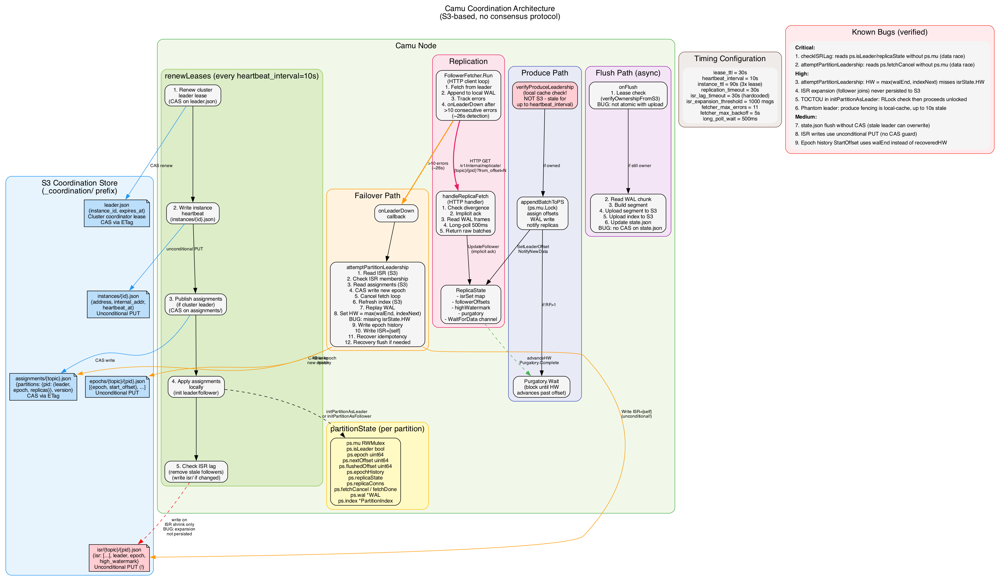

# Camu Coordination Architecture



## Overview

Camu uses **S3 as the sole coordination backend** — no ZooKeeper, etcd, or Raft. All distributed coordination (leader election, partition assignment, ISR management) is achieved through S3 objects with ETag-based conditional puts (CAS). This is simpler to operate but has weaker consistency guarantees than consensus-based systems.

## S3 Coordination Objects

All coordination state lives under the `_coordination/` prefix in the S3 bucket:

| Object | Schema | CAS? | Purpose |
|--------|--------|------|---------|
| `leader.json` | `{instance_id, expires_at}` | Yes (ETag) | Cluster coordinator lease — controls which node publishes assignments |
| `assignments/{topic}.json` | `{partitions: {pid: {leader, epoch, replicas}}, version}` | Yes (ETag) | Partition ownership map — who leads each partition |
| `isr/{topic}/{pid}.json` | `{isr: [...], leader, epoch, high_watermark}` | **No** (unconditional PUT) | In-sync replica set per partition |
| `epochs/{topic}/{pid}.json` | `[{epoch, start_offset}, ...]` | No (unconditional PUT) | Epoch history for divergence detection |
| `instances/{id}.json` | `{address, internal_addr, heartbeat_at}` | No (unconditional PUT) | Node registry — heartbeat for liveness |

## Two Independent Leadership Concepts

### Cluster Coordinator (`leader.json`)

One node holds the cluster coordinator lease. This node:
- Computes partition assignments (which node leads which partition)
- Publishes assignments to S3 via CAS
- Runs garbage collection on stale coordination objects

The lease has a TTL (`lease_ttl=30s`), renewed every `heartbeat_interval=10s`. If the coordinator dies, the lease expires and any node can acquire it. This is **not** partition leadership — a node can be the cluster coordinator without leading any partitions.

### Partition Leader (`assignments/{topic}.json`)

Each partition has a designated leader. The leader:
- Accepts produce writes
- Serves replication data to followers
- Manages the ISR set
- Flushes WAL to S3 segments

Partition leadership is recorded in the assignments object. Leadership changes via CAS on this object — either initiated by the cluster coordinator (rebalancing) or by a follower (failover via `attemptPartitionLeadership`).

## Background Coordination Loop

Every node runs `renewLeases` on a `heartbeat_interval=10s` tick:

```
1. Renew cluster leader lease          (CAS on leader.json)
2. Write instance heartbeat            (instances/{id}.json)
3. Publish assignments (if coordinator) (CAS on assignments/)
4. Apply assignments locally            (init leader/follower per partition)
5. Check ISR lag                        (remove stale followers, write isr/)
```

This loop is the primary mechanism for discovering assignment changes. A node learns about a new partition leader within one tick (up to 10s).

## Leader Election (Failover Path)

When a follower's fetch loop detects the leader is unreachable (>10 consecutive errors, ~26s for hard crash):

```
T+0s     Leader dies
T+0-26s  Follower fetch loop accumulates errors
T+26s    onLeaderDown fires → attemptPartitionLeadership
T+26s    1. Read ISR from S3 — am I in ISR?
T+26s    2. Read assignments from S3 (get ETag)
T+26s    3. CAS write: set self as leader, increment epoch
         → Exactly one node wins; losers get ErrConflict
T+26.1s  4. Cancel follower fetch goroutine
T+26.2s  5. Refresh index from S3
T+26.3s  6. Replay local WAL → find log end
T+26.3s  7. Set HW = max(walEnd, indexNext)
T+26.4s  8. Append epoch history entry, save to S3
T+26.4s  9. Write ISR=[self] to S3
T+26.5s  10. Recover idempotency state
T+26.5s  11. Recovery flush if needed
T+~27s   New leader serving writes

T+27-37s Other followers discover new leader via renewLeases tick
```

### Election Guards

- **ISR membership**: Only nodes in the ISR can win a clean election. Prevents stale replicas from becoming leader.
- **Epoch monotonicity**: Each election increments the epoch. Followers use epoch to detect divergence.
- **CAS atomicity**: The assignment write is atomic — only one node can win the race.

## Epoch and Divergence Detection

Each partition maintains an epoch history: `[{epoch: 1, startOffset: 0}, {epoch: 2, startOffset: 1500}, ...]`

When a follower connects to a new leader, the leader checks:
1. Does the follower's epoch match any entry in the history?
2. Is the follower's offset within the valid range for that epoch?

If the follower has data from a different epoch (wrote under an old leader after a split), the leader instructs it to truncate to the epoch boundary.

## ISR Management

### Expansion (follower joins ISR)
When a follower's lag falls within `isr_expansion_threshold=1000` messages, `UpdateFollower` adds it to the in-memory ISR set. **This is not persisted to S3** — only in-memory.

### Shrinkage (follower removed from ISR)
`checkISRLag` runs every renewal tick. If a follower hasn't contacted the leader within 30s (hardcoded), it's removed from ISR. The updated ISR is written to S3.

### High Watermark
HW = minimum offset confirmed by all ISR members. Only advances forward. Producers waiting in the purgatory are unblocked when HW passes their offset.

## Replication

### Current: HTTP/2 Long-Poll
- Follower sends `GET /v1/internal/replicate/{topic}/{pid}?from_offset=N`
- Leader reads WAL batch frames, returns raw bytes
- If no data, leader long-polls for 500ms via `WaitForData`
- Follower receives, appends to local WAL via `AppendBatchFrameLocked` (zero-copy — raw bytes forwarded)
- Implicit ack: follower's offset in the request header

### Data Flow (produce → replicate)
```
Producer → HTTP JSON → WAL write → NotifyNewData
                                      ↓
                          Follower fetch wakes up
                                      ↓
                          Leader reads raw WAL frames
                                      ↓
                          HTTP response with raw bytes
                                      ↓
                          Follower writes raw bytes to WAL
                                      ↓
                          Next fetch sends new offset (implicit ack)
                                      ↓
                          Leader advances HW → Purgatory.Complete
                                      ↓
                          Producer unblocked
```

## Flush Path

The batcher triggers `onFlush` when enough data accumulates or time elapses:

```
1. Lease check — verifyOwnershipFromS3 (reads assignments)
2. Read WAL chunk messages
3. Build segment (serialize + compress)
4. Upload segment to S3
5. Upload offset index to S3
6. Upload segment metadata to S3
7. Update state.json (partition state with epoch history, HW)
8. Update in-memory index
9. Prune flushed WAL chunks
```

## Timing Summary

| Parameter | Value | Controls |
|-----------|-------|----------|
| `lease_ttl` | 30s | Cluster coordinator lease validity |
| `heartbeat_interval` | 10s | Renewal tick + assignment discovery lag |
| `instance_ttl` | 90s | Node considered dead after this (3x lease) |
| `replication_timeout` | 30s | HTTP timeout per fetch request |
| ISR lag timeout | 30s (hardcoded) | Remove follower from ISR after silence |
| `isr_expansion_threshold` | 1000 msgs | Follower lag tolerance for ISR re-join |
| Fetcher error threshold | 11 errors | Declare leader down after this many |
| Fetcher max backoff | 5s | Cap on exponential backoff between retries |
| Long-poll wait | 500ms | Leader holds fetch response waiting for data |

## Failure Detection Timeline

| Scenario | Detection Time | Bottleneck |
|----------|---------------|------------|
| Hard crash (TCP refused) | ~26s | 11 fetcher errors with exponential backoff |
| Network hang (TCP hangs) | ~330s | 11 errors x 30s replication_timeout |
| Cluster coordinator death | 30s | Lease TTL expiry |
| Follower removed from ISR | 30s | Hardcoded lag timeout |
| Other followers discover new leader | 0-10s | Next renewLeases tick |

## Known Bugs

### Critical (data races — crash risk)

**1. `checkISRLag` accesses `ps.isLeader`, `ps.replicaState`, `ps.epoch` without `ps.mu`**
`server.go:1474`. Concurrent `attemptPartitionLeadership` can nil out `ps.replicaState` between the check and use → nil pointer dereference.

**2. `attemptPartitionLeadership` accesses `ps.fetchCancel` without `ps.mu`**
`server.go:1292`. `initPartitionAsFollower` writes these fields under `ps.mu.Lock` — this is a data race. Compare to `initPartitionAsLeader` (line 664) which correctly reads under lock.

### High (correctness issues)

**3. `attemptPartitionLeadership` doesn't use ISR HW in recovery**
`server.go:1346`. Sets `recoveredHW = max(walEnd, indexNext)` but doesn't read `isrState.HighWatermark`. `initPartitionAsLeader` (line 738-741) correctly includes it. If the ISR stored a higher HW, the new leader's HW regresses — consumers may re-read or miss messages.

**4. ISR expansion never persisted to S3**
`replica_state.go:85`. When a follower catches up and joins ISR, the change is in-memory only. `checkISRLag` only writes S3 on ISR shrinkage. If the leader crashes, S3 shows the old ISR without the follower → clean failover to that follower is blocked.

**5. TOCTOU in `initPartitionAsLeader`**
`server.go:649-654`. Checks `ps.isLeader` under `RLock`, releases, then does heavy initialization before acquiring `Lock` at line 711. Concurrent `attemptPartitionLeadership` can also pass the check → double initialization.

**6. Phantom leader accepts writes after losing leadership**
Produce fencing uses local cache (`s.myPartitions`) updated on renewal tick (up to 10s stale). After another node wins the partition CAS, the old leader still accepts writes for up to `heartbeat_interval`. These writes get 200 OK but are never replicated or flushed → silent data loss.

### Medium (defensive hardening)

**7. `state.json` flush without CAS**
`partition_manager.go onFlush`. Lease check and S3 upload are non-atomic. A stale leader can complete a flush and overwrite `state.json` with older epoch history.

**8. ISR writes use unconditional PUT**
`server.go:1484`. `etag: ""` means last writer wins. Under split brain, both leaders can overwrite each other's ISR.

**9. Epoch history `StartOffset` uses `walEnd` instead of `recoveredHW`**
`server.go:1373`. If S3 index has data beyond WAL (`indexNext > walEnd`), the epoch boundary is wrong and divergence detection may miss data that should be truncated.
